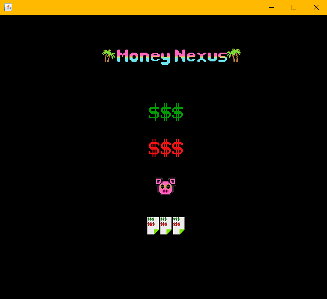

## Money Nexus

## Alunos
|Matrícula | Aluno |
| -- | -- |
| 18/0118005  |  Carlos Rafael Vasconcelos de Matos |
| 18/0121847  |   Helder Lourenço de Abreu Marques |                      |

## Sobre
Aplicativo desktop para controle de entrada e saida de caixa - feito durante a disciplina de Orientação a Objetos

## Screenshots

## Instalação
**Linguagem**: Java 
**Framework**: Java Swing 
Necessária a Instalação do JDK(preferência 15);

